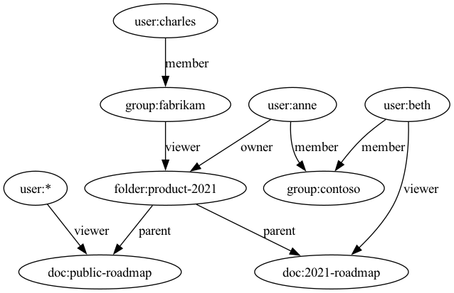

# rel2dot

Create GraphViz dot file from Topaz relations JSON file.

## install rel2dot

```
go install github.com/aserto-dev/rel2dot@latest
```

## generate dot file
```
rel2dot -f -i ./topaz-samples/gdrive/data/relations.json | dot -Tpng > gdrive.png
```

## visualize dot file


